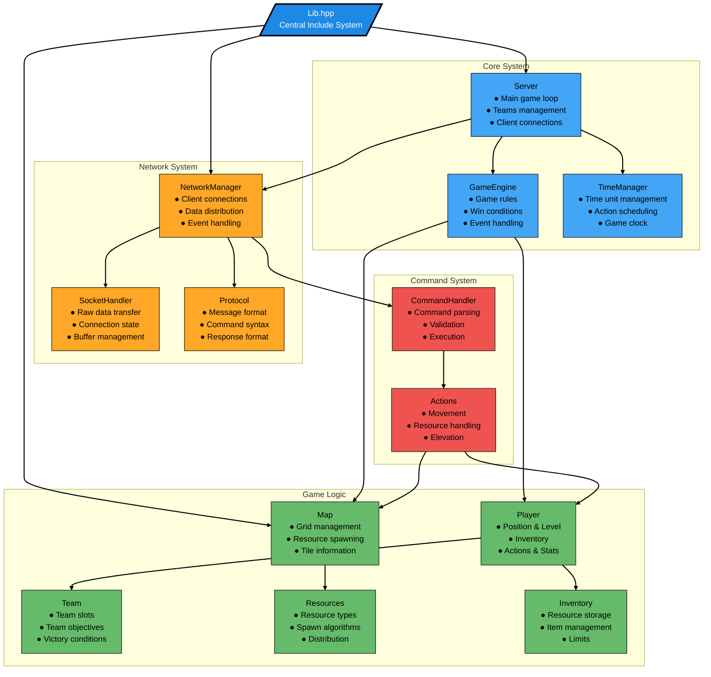

# zappy_42
Build a network-based multiplayer game.

## Progress

```mermaid
graph TD
    subgraph "Core Infrastructure"
        A[Project Setup ✓]
        B[Base Server ✓]
        C[Socket Management ✓]
        D[Network Manager ✓]
        E[Unit Tests ✓]
    end

    subgraph "Server Features"
        F[Event Loop]
        G[Command Parser]
        H[Game Logic]
        I[Map Management]
        J[Resource System]
        K[Player Management]
    end

    subgraph "Game Elements"
        L[Teams]
        M[Inventory]
        N[Resources]
        O[Incantations]
        P[Time Management]
    end

    subgraph "Client/AI"
        Q[AI Logic]
        R[Path Finding]
        S[Resource Collection]
        T[Team Coordination]
    end

    subgraph "GUI"
        U[Graphics Engine]
        V[Map Visualization]
        W[Player Display]
        X[Resource View]
        Y[Game State Monitor]
    end

    A --> B
    B --> C
    C --> D
    D --> E
    E --> F
    F --> G
    G --> H
    H --> I
    I --> J
    J --> K
    K --> L
    L --> M
    M --> N
    N --> O
    O --> P
    P --> Q
    Q --> R
    R --> S
    S --> T
    T --> U
    U --> V
    V --> W
    W --> X
    X --> Y

    classDef done fill:#90EE90,color:#000000
    classDef doing fill:#FFB6C1,color:#000000
    classDef todo fill:#D3D3D3,color:#000000
    
    class A,B,C,D,E done
    class F doing
    class G,H,I,J,K,L,M,N,O,P,Q,R,S,T,U,V,W,X,Y todo
```



## Project Structure
```
zappy_42/
├── CMakeLists.txt
├── include/
│   ├── core/
│   │   ├── Server.hpp
│   │   └── Client.hpp
│   ├── network/
│   │   ├── NetworkManager.hpp
│   │   └── SocketHandler.hpp
│   ├── utils/
│   │   ├── Logger.hpp
│   │   └── Exception.hpp
│   └── Lib.hpp
├── src/
│   ├── core/
│   │   ├── Server.cpp
│   │   └── Client.cpp
│   ├── network/
│   │   ├── NetworkManager.cpp
│   │   └── SocketHandler.cpp
│   ├── utils/
│   │   └── Logger.cpp
│   └── main.cpp
└── tests/
    ├── core_tests/
    │   ├── ServerTest.cpp
    │   └── ClientTest.cpp
    ├── network_tests/
    │  ├── NetworkManagerTest.cpp
    |  └── SocketHandlerTest.cpp
    ├── utils_tests/
    │   ├── LoggerTest.cpp
    |   └── ExceptionTest.cpp
    └── mainTest.cpp
```

## Project Architecture


## Building the Project
```bash
mkdir build && cd build
cmake ..
make
```

## Running Tests
```bash
./tests/zappy_tests
```

## Running the Server
```bash
./zappy_server <port>
```