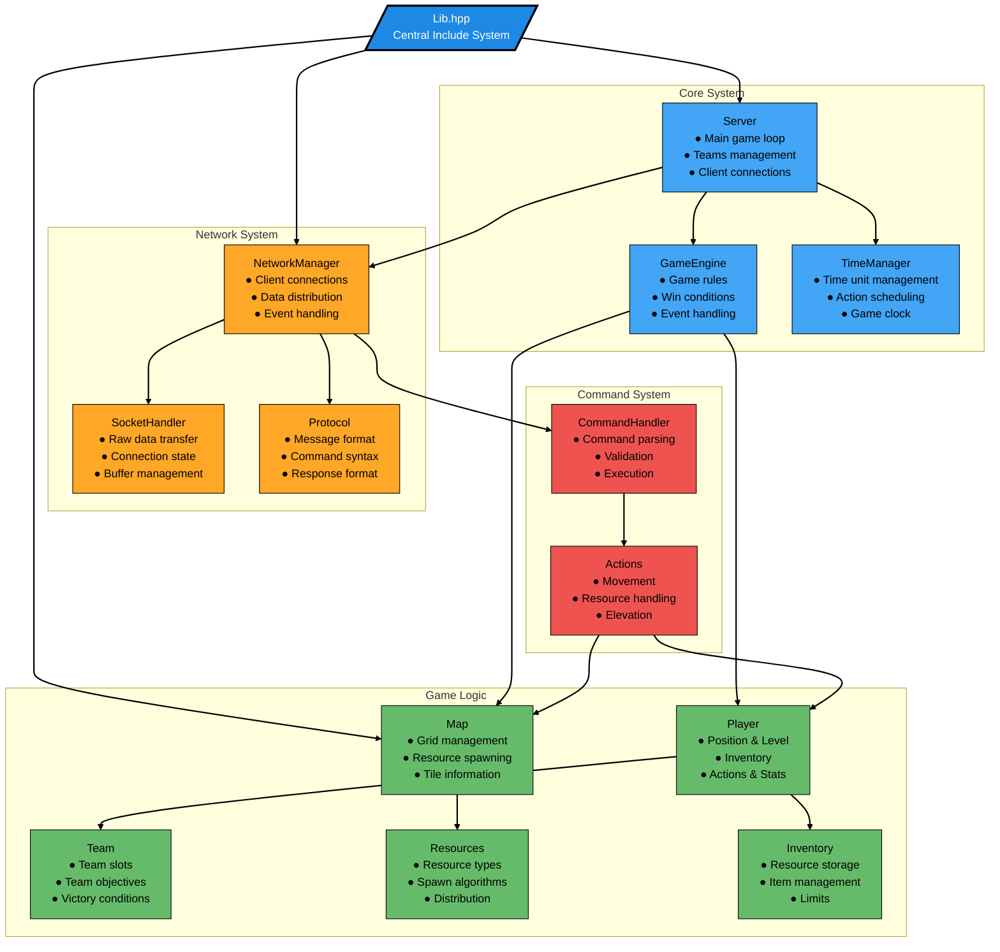

# zappy_42
Build a network-based multiplayer game.

## Project Structure
```
zappy_42/
├── CMakeLists.txt
├── include/
│   ├── core/
│   │   ├── Server.hpp
│   │   └── Client.hpp
│   ├── network/
│   │   ├── NetworkManager.hpp
│   │   └── SocketHandler.hpp
│   ├── utils/
│   │   ├── Logger.hpp
│   │   └── Exception.hpp
│   └── Lib.hpp
├── src/
│   ├── core/
│   │   ├── Server.cpp
│   │   └── Client.cpp
│   ├── network/
│   │   ├── NetworkManager.cpp
│   │   └── SocketHandler.cpp
│   ├── utils/
│   │   ├── Logger.cpp
│   │   └── Exception.cpp
│   └── main.cpp
└── tests/
    ├── core/
    │   ├── ServerTest.cpp
    │   └── ClientTest.cpp
    └── network/
        └── NetworkTest.cpp
```

## Project Architecture


## Building the Project
```bash
mkdir build && cd build
cmake ..
make
```

## Running Tests
```bash
./tests/zappy_tests
```

## Running the Server
```bash
./zappy_server <port>
```